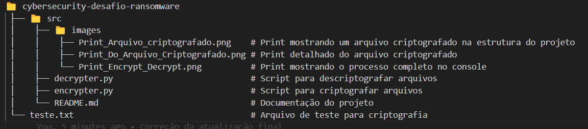
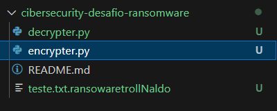
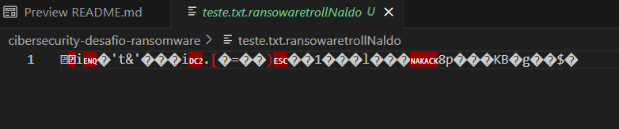
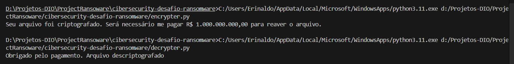

# 🚀cibersecurity-desafio-ransomware
Repositório para o desafio Entendendo um Ransoware na prática com Python do Santander Bootcamp Cibersegurança #2

> ⚠️ **Aviso:** Este projeto é exclusivamente para fins educacionais e de aprendizado. O uso malicioso de qualquer código deste repositório é estritamente proibido e pode ser considerado crime. 

## 🧰 Tecnologias Utilizadas
- **Python 3.11**
- **Bibliotecas**:
  - `os` - Para manipulação de arquivos e diretórios no sistema operacional.
  - `pyaes` - Para implementar criptografia AES.

  ## 📂 Estrutura do Projeto
 

## 📸 Prints

### - Print mostrando um arquivo criptografado na estrutura do projeto

### - Print detalhado do arquivo criptografado

### - Print mostrando o processo completo no console

